# itelect2-project
My IT Elective 2 backend web development project.

## API TESTING ##

#### Get Tasks
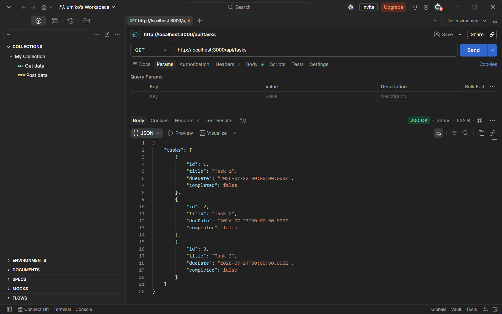

---

#### Post Tasks

Post with valid body returns 201.

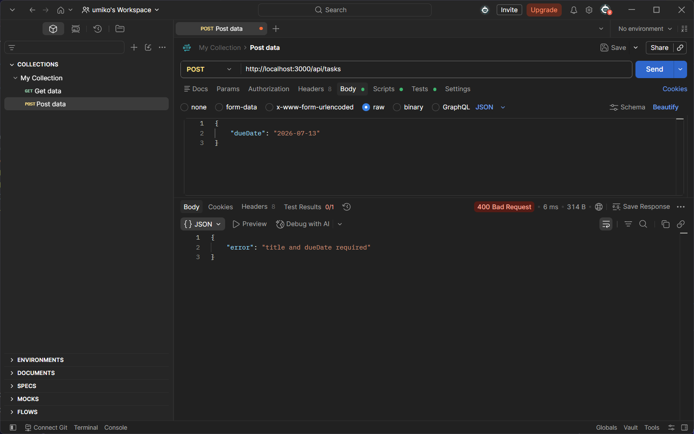
Post with a missing title returns 400.

---

#### Put Tasks

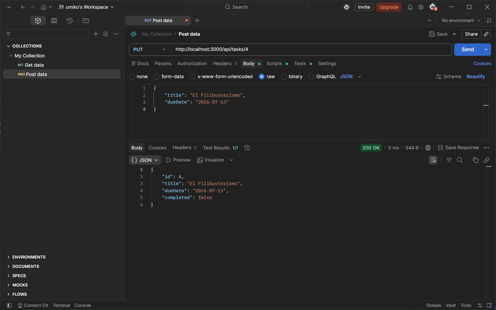
Put with an existing id returns 200.

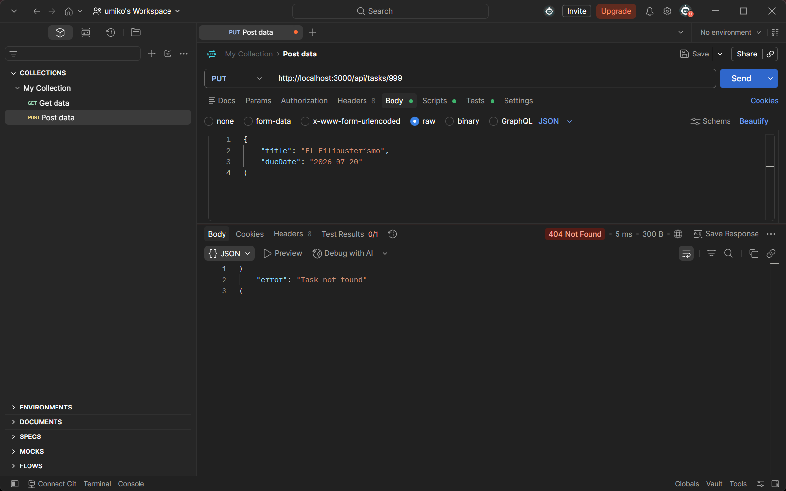
Put with id 999 returns 404.

---

#### Delete Tasks

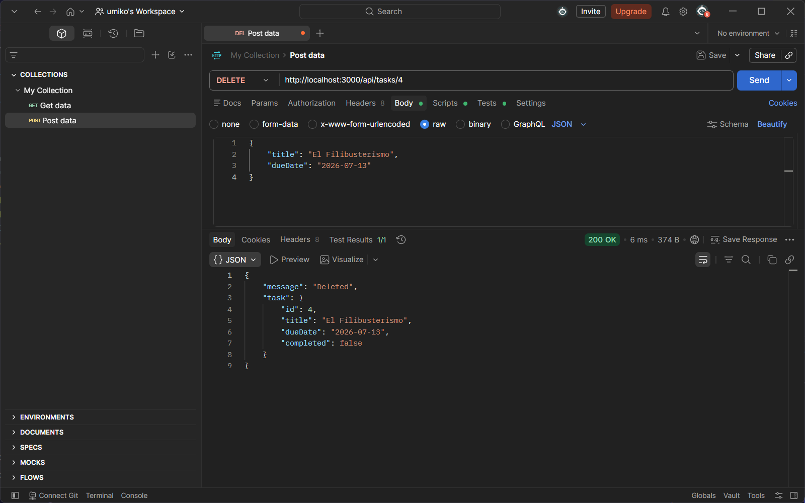
Delete with an existing id returns 200.

.png>)
Delete on the same id returns 404.

Delete with id 999 returns 404.

---

## Sequelize API Routes ##

#### Get Tasks 

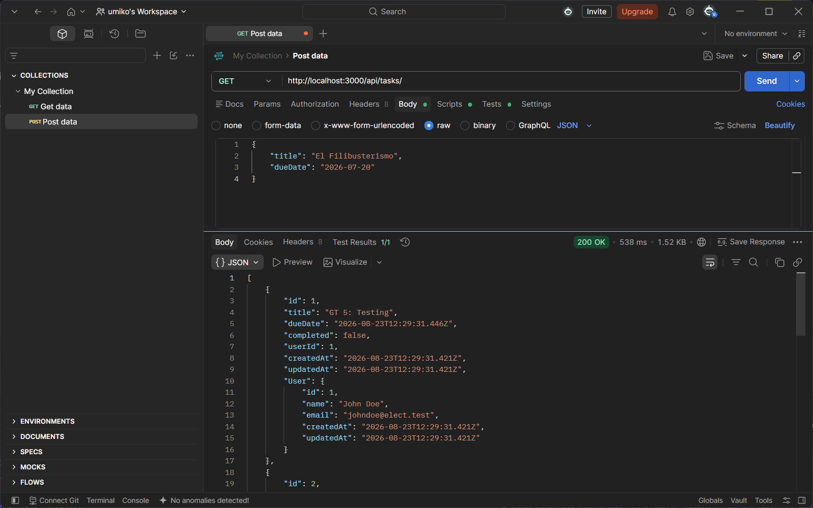
Get tasks returns 200. Returns each task with User object nested inside it.

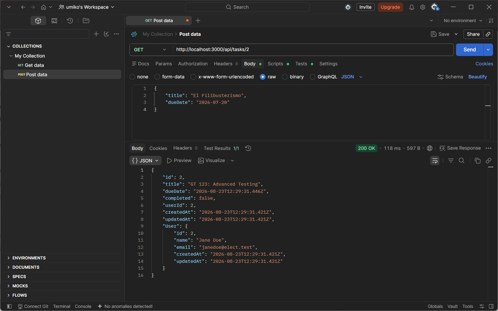
Get specific task returns 200.

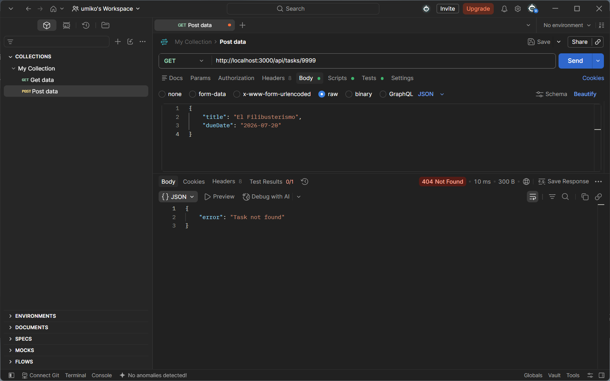
Get task with id 9999 returns 404. 

---

#### Post Tasks 

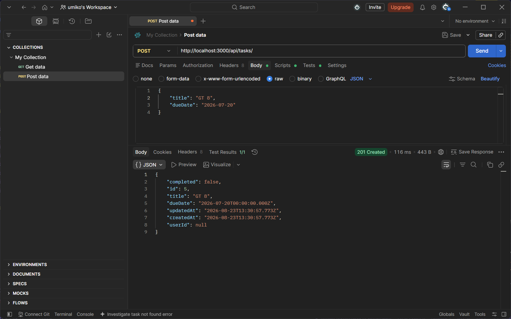
Post tasks returns 201.

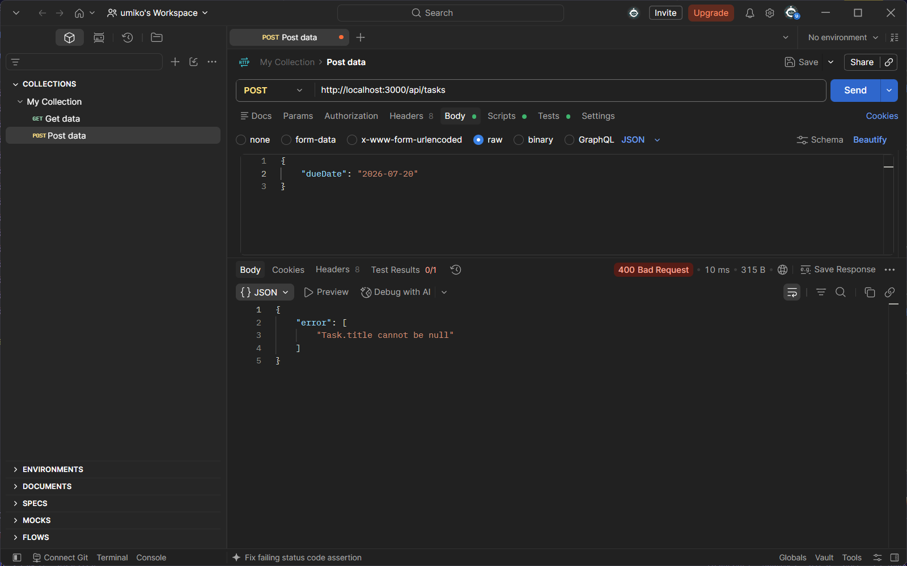
Post task with missing title returns 400.

---

#### Put Tasks 

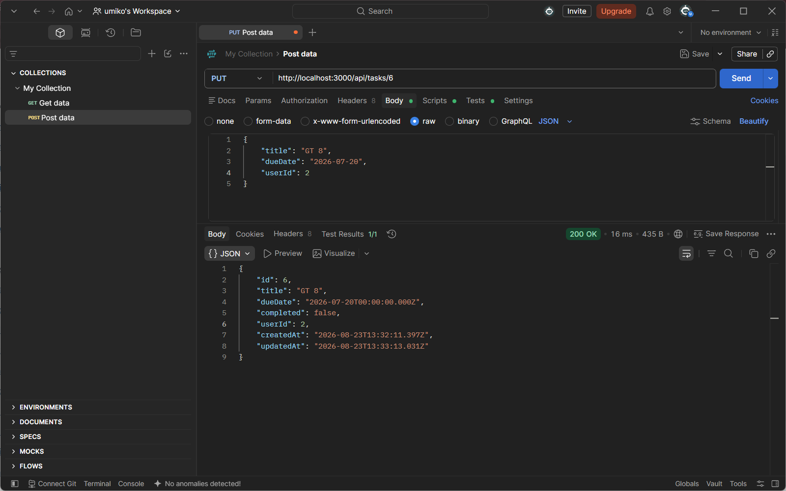
Put tasks with existing id returns 200.

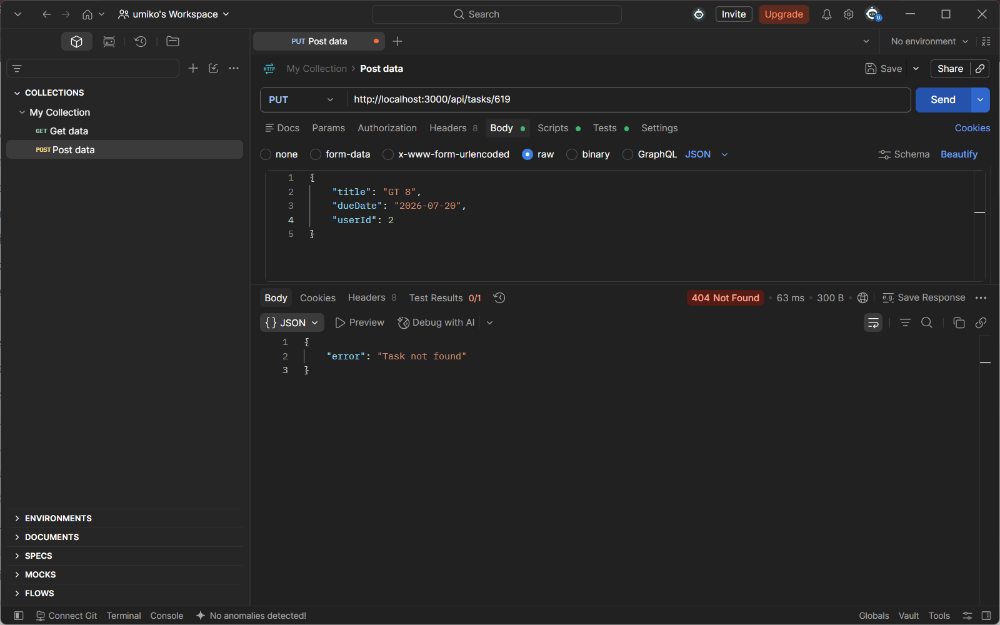
Put tasks with id 619 returns 404.

---

#### Delete Tasks

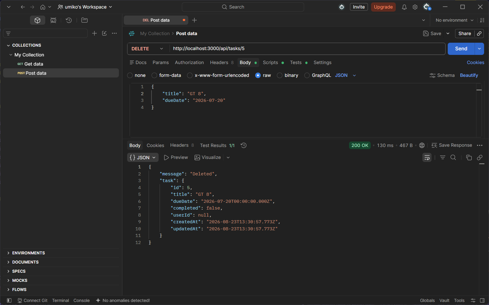
Delete tasks with existing id returns 200.

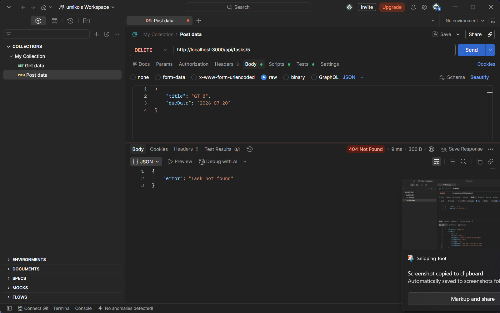
Delete on the same id returns 404.

---

#### pgadmin tables

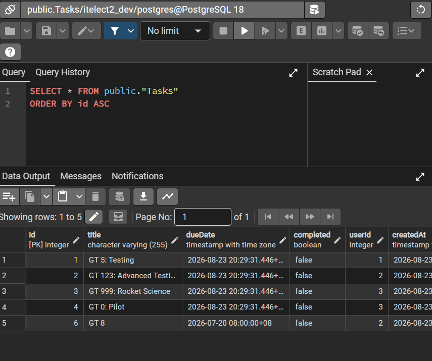
Screenshot of tasks table on pgadmin.

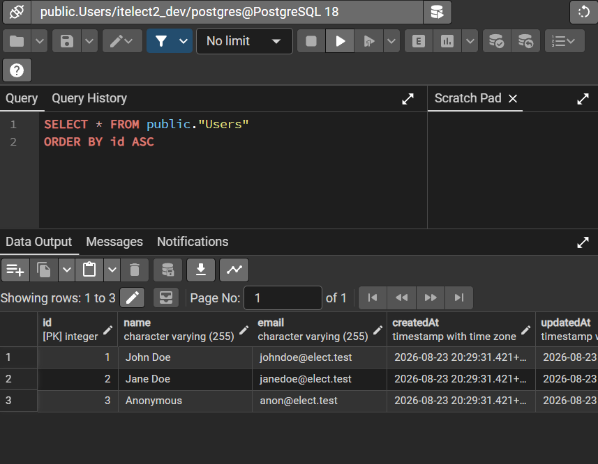
Screenshot of users table on pgadmin.